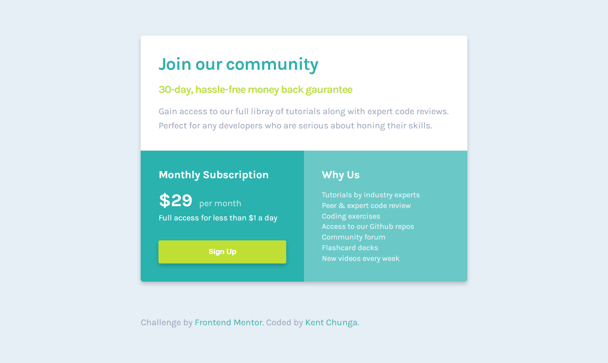

# Frontend Mentor - Single price grid component solution

This is a solution to the [Single price grid component challenge on Frontend Mentor](https://www.frontendmentor.io/challenges/single-price-grid-component-5ce41129d0ff452fec5abbbc). Frontend Mentor challenges help you improve your coding skills by building realistic projects.  

## Table of contents.

- [Overview](#overview)
  - [The challenge](#the-challenge)
  - [Screenshot](#screenshot)
  - [Links](#links)
- [My process](#my-process)
  - [Built with](#built-with)
  - [What I learned](#what-i-learned)
  - [Continued development](#continued-development)
  - [Useful resources](#useful-resources)
- [License](#license)
- [Author](#author)

## Overview

### The challenge

Users should be able to:

- View the optimal layout for the component depending on their device's screen size
- See a hover state on desktop for the Sign Up call-to-action


### Screenshot
#### Desktop preview.


#### Mobile preview.


### Links

- Solution URL: [https://www.github.com/KentCP/single-price-grid-component](https://www.github.com/KentCP/single-price-grid-component)
- Live Site URL: [https://kentcp.github.io/single-price-grid-componen/](https://kentcp.github.io/single-price-grid-componen/)

## My process

### Built with

- Semantic HTML5 markup
- CSS custom properties
- CSS Grid
- Mobile-first workflow

### What I learned

Working through this project helped me to practice my HTML and CSS skills that  i learned after watching a couple of web development tutorials as well as reading books. 

This project also helped me in develping skills  to build/develop a website from a design. And am so glad that after all the strugle of getting  styles like `font-size`, `padding`, `margin` `etc`, from the design by just looking through the designs, i managed to  build and complete this single price grid component challenge  which is just as close as to the the designs provided in this challenge.

```html
<p>Coding is fun :)</p>
```

### Continued development
[Go to top](#table-of-contents)

### Useful resources

- [CSS Tricks](https://www.csstricks.io) - This is an amazing article which helped me finally understand css grid property. I'd recommend it to anyone still learning this concept.
- [W3Schools](www.w3schools.com/css/css_rwd_mediaqueries.html) - This helped me to understand media queries especially how the  `min-width` and `max-width` works in media queries. This in turn helped me to manage the mobile-first workflow process indicated in - [My process](#my-process) section above.

### License
This project is licensed under the terms of the MIT license.
[Read thr full license here](https://github.com/KentCP/Single-price-grid-component/blob/main/LICENSE)

## Author

- Twitter - [@KentChunga](https://www.twitter.com/KentChunga)
- Facebook - [Kent Kismet Chunga](https://www.facebook.com/kentkeph.williams)
- Frontend Mentor - [@KentCP](https://www.frontendmentor.io/profile/KentCP)

:wave::wave:.
